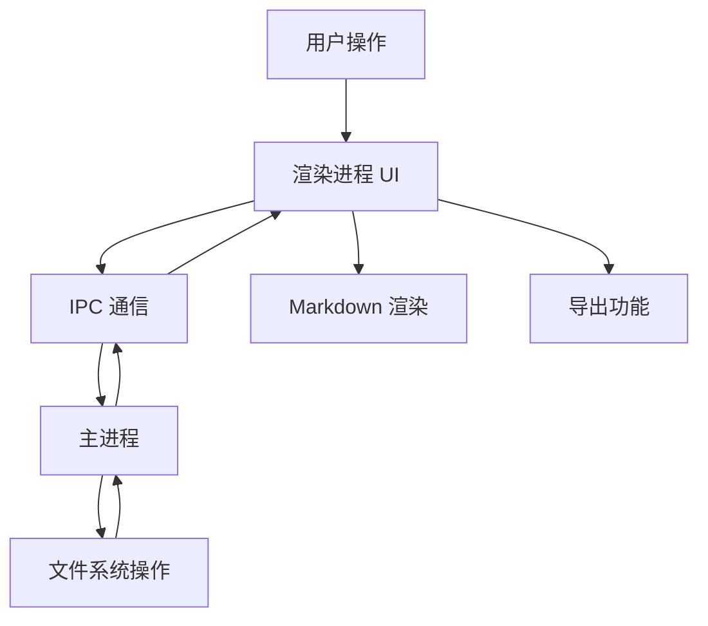

# Markdown Notebook - Code Wiki

## 1. 项目概览

Markdown Notebook 是一个类似 Typora 的本地 Markdown 笔记本工具，提供资源管理器、多标签页编辑、预览与导出等能力。当前为 Electron 桌面应用。

- **当前版本**：v1.0
- **主要功能**：
  - 增强型资源管理器，支持树状结构展示目录和文件
  - 多标签页编辑，支持同时打开多个文件并快速切换
  - 编辑/分屏/预览三种视图模式
  - Markdown 渲染，支持 GitHub 风格 Markdown (GFM) 和 Mermaid 图表
  - 保存与自动保存功能
  - 多格式导出（PDF、Word）
  - 图片支持，包括拖拽图片到编辑器

## 2. 技术架构

### 2.1 整体架构

Markdown Notebook 采用 Electron + React 技术栈，分为以下几个主要部分：

| 层级 | 技术 | 职责 | 文件位置 |
|------|------|------|----------|
| 主进程 | Electron | 窗口管理、文件系统操作、应用菜单 | [electron/main.cjs](file:///workspace/electron/main.cjs) |
| 渲染进程 | React 18 + TypeScript | UI 渲染、用户交互 | [src/App.tsx](file:///workspace/src/App.tsx) |
| 通信层 | IPC | 主进程与渲染进程通信 | [electron/preload.cjs](file:///workspace/electron/preload.cjs) |
| 样式 | Tailwind CSS | 界面样式 | [src/index.css](file:///workspace/src/index.css) |
| 功能库 | react-markdown, mermaid, jspdf 等 | 提供 Markdown 渲染、图表渲染、导出等功能 | [package.json](file:///workspace/package.json) |

### 2.2 核心流程图



## 3. 项目结构

```
├── build/              # 构建资源（图标等）
├── electron/           # Electron 相关文件
│   ├── main.cjs        # 主进程入口
│   └── preload.cjs     # 预加载脚本
├── src/                # 渲染进程源代码
│   ├── components/     # React 组件
│   ├── hooks/          # 自定义 hooks
│   ├── lib/            # 工具库
│   ├── types/          # TypeScript 类型定义
│   ├── utils/          # 工具函数
│   ├── App.tsx         # 主应用组件
│   ├── global.d.ts     # 全局类型声明
│   ├── index.css       # 全局样式
│   └── main.tsx        # 渲染进程入口
├── .gitignore          # Git 忽略文件
├── LICENSE             # 开源协议
├── README.md           # 项目说明
├── index.html          # HTML 模板
├── package-lock.json   # 依赖锁定文件
├── package.json        # 项目配置
├── postcss.config.js   # PostCSS 配置
├── tailwind.config.js  # Tailwind CSS 配置
├── tsconfig.json       # TypeScript 配置
├── tsconfig.node.json  # TypeScript 节点配置
└── vite.config.ts      # Vite 配置
```

## 4. 主要模块与职责

### 4.1 主应用模块 (App.tsx)

**职责**：
- 文件树管理：浏览、创建、删除文件和文件夹
- 标签页管理：多文件编辑，支持重命名
- Markdown 编辑器：实时编辑，支持拖拽图片
- Markdown 预览：支持 GFM、Mermaid 图表
- 导出功能：导出为 PDF、Word
- 会话管理：自动保存和恢复会话状态
- 撤销/重做：编辑历史管理

**核心功能**：
- `openFolder()`: 打开文件夹并加载文件树
- `refreshFileTree()`: 刷新文件树
- `openFileFromFs()`: 从文件系统打开文件
- `createNewFile()`: 创建新文件
- `createNewFolder()`: 创建新文件夹
- `closeTab()`: 关闭标签页
- `saveActiveFile()`: 保存当前文件
- `exportPDF()`: 导出为 PDF
- `exportWord()`: 导出为 Word

### 4.2 Electron 主进程模块 (main.cjs)

**职责**：
- 创建和管理应用窗口
- 处理文件系统操作（读写、删除、重命名等）
- 设置应用菜单
- 处理对话框（打开文件夹、保存文件等）

**核心功能**：
- `createWindow()`: 创建主窗口
- `listTree()`: 递归列出目录树
- `resolveSafePath()`: 安全解析路径，防止路径遍历攻击
- IPC 处理器：处理来自渲染进程的各种请求

### 4.3 组件模块 (components/)

**组件列表**：
- `AboutDialog.tsx`: 关于对话框
- `MermaidDiagram.tsx`: Mermaid 图表渲染组件
- `ResolvedMarkdownImage.tsx`: Markdown 图片解析组件

### 4.4 工具库模块 (lib/)

**职责**：
- 提供常量定义
- 提供路径处理工具函数

**文件**：
- `constants.ts`: 常量定义（如图片扩展名、默认自动保存时间等）
- `path.ts`: 路径处理工具函数

### 4.5 自定义 Hooks 模块 (hooks/)

**职责**：
- 提供自动保存功能
- 提供历史记录管理
- 提供会话管理

**文件**：
- `useAutoSave.ts`: 自动保存 Hook
- `useHistory.ts`: 历史记录管理 Hook
- `useSession.ts`: 会话管理 Hook

## 5. 核心 API/类/函数

### 5.1 App 组件 (App.tsx)

**核心函数**：

| 函数名 | 描述 | 参数 | 返回值 |
|--------|------|------|--------|
| `openFolder()` | 打开文件夹并加载文件树 | 无 | Promise<void> |
| `refreshFileTree()` | 刷新文件树 | 无 | Promise<void> |
| `openFileFromFs()` | 从文件系统打开文件 | relPath: string | Promise<void> |
| `createNewFile()` | 创建新文件 | parentPath?: string | Promise<void> |
| `createNewFolder()` | 创建新文件夹 | parentPath?: string | Promise<void> |
| `closeTab()` | 关闭标签页 | id: string, e: React.MouseEvent | void |
| `saveActiveFile()` | 保存当前文件 | 无 | Promise<void> |
| `exportPDF()` | 导出为 PDF | 无 | Promise<void> |
| `exportWord()` | 导出为 Word | 无 | void |
| `updateActiveContent()` | 更新当前标签页的内容 | content: string, options?: { recordHistory?: boolean } | void |
| `undoActive()` | 撤销操作 | 无 | void |
| `redoActive()` | 重做操作 | 无 | void |

### 5.2 Electron 主进程 (main.cjs)

**核心函数**：

| 函数名 | 描述 | 参数 | 返回值 |
|--------|------|------|--------|
| `createWindow()` | 创建主窗口 | 无 | void |
| `listTree()` | 递归列出目录树 | rootPath: string, currentAbs: string, currentRel: string | Promise<Array> |
| `resolveSafePath()` | 安全解析路径 | rootPath: string, relPath: string | string |
| `isInside()` | 判断子路径是否在父路径内 | parent: string, child: string | boolean |
| `extToMime()` | 根据文件扩展名获取 MIME 类型 | ext: string | string |

**IPC 处理器**：

| 处理器名 | 描述 | 触发方式 |
|----------|------|----------|
| `dialog:openFolder` | 打开文件夹对话框 | 渲染进程调用 |
| `dialog:openImages` | 打开图片文件对话框 | 渲染进程调用 |
| `dialog:saveMarkdown` | 保存 Markdown 文件对话框 | 渲染进程调用 |
| `fs:listTree` | 列出目录树 | 渲染进程调用 |
| `fs:readTextFile` | 读取文本文件 | 渲染进程调用 |
| `fs:writeTextFile` | 写入文本文件 | 渲染进程调用 |
| `fs:mkdir` | 创建目录 | 渲染进程调用 |
| `fs:importFiles` | 导入文件 | 渲染进程调用 |
| `fs:deleteEntry` | 删除文件或目录 | 渲染进程调用 |
| `fs:readFileAsDataUrl` | 读取文件为 Data URL | 渲染进程调用 |
| `fs:writeBase64FileUnique` | 写入 Base64 文件（自动处理重名） | 渲染进程调用 |
| `fs:rename` | 重命名文件或目录 | 渲染进程调用 |

### 5.3 工具函数 (lib/)

**路径处理函数**：
- `isProbablyExternalUrl()`: 判断是否为外部 URL
- `normalizePath()`: 标准化路径

**常量**：
- `IMAGE_EXTENSIONS`: 支持的图片扩展名
- `DEFAULT_AUTOSAVE_MINUTES`: 默认自动保存时间（分钟）

## 6. 技术栈与依赖

### 6.1 核心技术栈

| 技术 | 版本 | 用途 | 来源 |
|------|------|------|------|
| React | ^18.2.0 | 前端框架 | [package.json](file:///workspace/package.json) |
| TypeScript | ^5.2.2 | 类型系统 | [package.json](file:///workspace/package.json) |
| Electron | ^35.0.0 | 桌面应用框架 | [package.json](file:///workspace/package.json) |
| Tailwind CSS | ^3.4.1 | 样式框架 | [package.json](file:///workspace/package.json) |
| Vite | ^5.1.6 | 构建工具 | [package.json](file:///workspace/package.json) |

### 6.2 功能库

| 库 | 版本 | 用途 | 来源 |
|----|------|------|------|
| react-markdown | ^9.0.1 | Markdown 渲染 | [package.json](file:///workspace/package.json) |
| remark-gfm | ^4.0.0 | GitHub 风格 Markdown 支持 | [package.json](file:///workspace/package.json) |
| lucide-react | ^0.344.0 | 图标库 | [package.json](file:///workspace/package.json) |
| jspdf | ^2.5.1 | PDF 导出 | [package.json](file:///workspace/package.json) |
| html2canvas | ^1.4.1 | HTML 转 Canvas（用于 PDF 导出） | [package.json](file:///workspace/package.json) |
| file-saver | ^2.0.5 | 文件下载（用于 Word 导出） | [package.json](file:///workspace/package.json) |
| mermaid | ^10.9.1 | 图表渲染 | [package.json](file:///workspace/package.json) |

## 7. 运行与开发

### 7.1 安装依赖

```bash
npm install
```

### 7.2 开发启动

```bash
npm run dev
```

此命令会先构建前端产物，然后启动 Electron 应用。

### 7.3 直接启动

```bash
npm start
```

此命令需要已存在 dist 目录，例如先执行过 `npm run build:web`。

### 7.4 构建命令

| 命令 | 描述 | 输出目录 |
|------|------|----------|
| `npm run build:web` | 构建前端产物 | dist/ |
| `npm run build:app` | 打包桌面安装包 | release/ |

## 8. 核心功能实现

### 8.1 文件树管理

- **功能**：以树状结构展示目录和文件，支持展开/折叠、创建文件/文件夹、删除、导入图片
- **实现**：
  - 主进程通过 `listTree()` 函数递归读取目录结构
  - 渲染进程通过 `renderFileTree()` 函数渲染树状结构
  - 支持拖拽图片到编辑器

### 8.2 多标签页编辑

- **功能**：支持同时打开多个文件并快速切换，双击标签页重命名（会同步重命名磁盘文件）
- **实现**：
  - 使用 `openTabs` 状态管理标签页列表
  - 使用 `activeTabId` 状态管理当前激活的标签页
  - 支持新建未命名标签页
  - 支持标签页重命名，同步到文件系统

### 8.3 编辑体验

- **功能**：支持编辑/分屏/预览三种视图，支持撤销/重做，支持拖拽图片到编辑器
- **实现**：
  - 使用 `viewMode` 状态管理视图模式
  - 使用 `historyRef` 管理撤销/重做历史
  - 实现 `updateActiveContent()` 函数更新内容并记录历史
  - 实现 `onDropToEditor()` 函数处理拖拽图片

### 8.4 Markdown 渲染

- **功能**：支持 GitHub 风格 Markdown (GFM)，支持 Mermaid 图表
- **实现**：
  - 使用 `react-markdown` 和 `remark-gfm` 渲染 Markdown
  - 使用 `MermaidDiagram` 组件渲染 Mermaid 图表
  - 使用 `ResolvedMarkdownImage` 组件处理图片路径

### 8.5 保存与自动保存

- **功能**：支持手动保存（Ctrl+S）和自动保存，可设置自动保存时间间隔
- **实现**：
  - 使用 `saveActiveFile()` 函数保存当前文件
  - 使用 `autoSaveTimerRef` 管理自动保存定时器
  - 支持从设置菜单中调整自动保存时间

### 8.6 多格式导出

- **功能**：支持导出为 PDF 和 Word 格式
- **实现**：
  - `exportPDF()`：使用 `html2canvas` 将预览区域转换为图片，然后使用 `jspdf` 生成 PDF
  - `exportWord()`：将预览区域的 HTML 包装为 Word 文档

### 8.7 会话管理

- **功能**：启动时自动恢复上次未关闭的文件夹与标签页
- **实现**：
  - 使用 `localStorage` 存储会话状态
  - 实现 `restore()` 函数从 localStorage 恢复会话
  - 实现 `persist()` 函数将当前状态保存到 localStorage

## 9. 安全考虑

### 9.1 路径安全

- **实现**：使用 `resolveSafePath()` 函数安全解析路径，防止路径遍历攻击
- **措施**：
  - 所有文件操作必须保持在选择的根目录内
  - 使用 `isInside()` 函数验证路径是否在根目录内

### 9.2 Electron 安全

- **实现**：
  - 启用上下文隔离 (`contextIsolation: true`)
  - 禁用 Node.js 集成 (`nodeIntegration: false`)
  - 通过 preload 脚本暴露必要的 API

### 9.3 输入验证

- **实现**：对用户输入进行验证，例如：
  - 重命名标签页时验证文件名
  - 处理文件路径时进行安全检查

## 10. 常见问题与解决方案

### 10.1 无法保存文件

**问题**：保存文件失败，提示权限错误
**解决方案**：
- 确保已授予应用文件夹写入权限
- 确保文件未被其他程序占用

### 10.2 图片拖拽失败

**问题**：拖拽图片到编辑器失败
**解决方案**：
- 确保已打开一个文件夹
- 确保已授予应用文件夹写入权限

### 10.3 导出 PDF 失败

**问题**：导出 PDF 时出错
**解决方案**：
- 确保预览区域已就绪
- 确保图片已加载完成

## 11. 未来优化方向

1. **性能优化**：
   - 优化大文件的加载和渲染
   - 优化文件树的渲染性能

2. **功能增强**：
   - 支持更多 Markdown 扩展
   - 支持代码高亮
   - 支持表格编辑

3. **用户体验**：
   - 增加主题切换功能
   - 增加更多快捷键
   - 改进文件搜索功能

4. **跨平台优化**：
   - 优化不同操作系统的体验
   - 确保在所有平台上的一致性

## 12. 总结

Markdown Notebook 是一个功能强大的本地 Markdown 编辑工具，基于 Electron 和 React 技术栈构建。它提供了丰富的功能，包括资源管理器、多标签页编辑、实时预览、图表渲染、多格式导出等。项目结构清晰，代码组织合理，具有良好的可维护性和扩展性。

通过安全的文件系统操作、流畅的用户界面和丰富的功能，Markdown Notebook 为用户提供了一个高效、便捷的 Markdown 编辑环境，适合用于笔记、文档编写等场景。